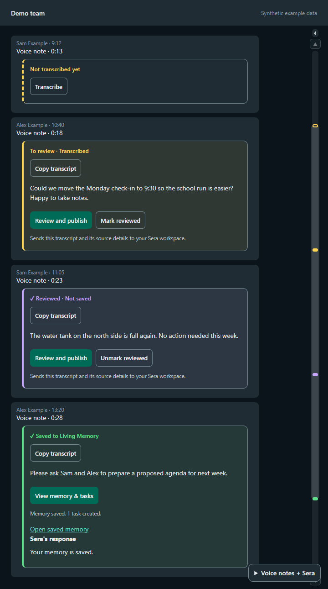

# Sera Relay

Read your WhatsApp voice notes as text, right inside WhatsApp, on your Windows PC or Mac. Speech is transcribed on your own computer. If your team uses Sera, you can turn a note into a reviewed shared memory and follow-up tasks in one step.

<p>
  <a href="https://github.com/Agent5D-369/sera-relay/releases/latest/download/SeraRelay-Windows-Setup.exe"><b>Download for Windows</b></a>
  &nbsp;·&nbsp;
  <a href="https://github.com/Agent5D-369/sera-relay/releases/latest/download/SeraRelay-macOS.dmg"><b>Download for Mac</b></a>
  &nbsp;·&nbsp;
  <a href="https://github.com/Agent5D-369/sera-relay/releases">All releases</a>
</p>



Screenshots use fictional demo data.

## Install

You need Google Chrome or Microsoft Edge installed, and about 2 GB of free space. The download is around 600 MB because the speech model is included, so nothing else needs to be installed. Sera Relay is free and open source. It is a beta and is not yet code-signed, so your computer asks you to confirm the first time. The steps below show exactly what to click.

### Windows 10 or 11 (64-bit)

1. Download **[SeraRelay-Windows-Setup.exe](https://github.com/Agent5D-369/sera-relay/releases/latest/download/SeraRelay-Windows-Setup.exe)** and open it.
2. If Windows shows "Windows protected your PC", select **More info**, then **Run anyway**.
3. Setup installs for your account only. No administrator password is needed. Sera Relay opens when it finishes, and it is in your Start menu and on your Desktop.

Prefer one line? Open PowerShell and paste:

```powershell
irm https://raw.githubusercontent.com/Agent5D-369/sera-relay/main/install.ps1 | iex
```

### Mac with Apple Silicon (M1 or newer)

The easiest way is one line. Open **Terminal** (press Command + Space, type Terminal, press Return), paste this, and press Return:

```bash
curl -fsSL https://raw.githubusercontent.com/Agent5D-369/sera-relay/main/install.sh | bash
```

It downloads Sera Relay, checks the download, puts it in Applications, and opens it.

Or use the disk image:

1. Download **[SeraRelay-macOS.dmg](https://github.com/Agent5D-369/sera-relay/releases/latest/download/SeraRelay-macOS.dmg)**, open it, and drag **Sera Relay** to **Applications**.
2. Open Sera Relay. macOS says it cannot verify the developer. Select **Done**.
3. Open **System Settings > Privacy & Security**, scroll down, and select **Open Anyway** next to Sera Relay, then confirm (with your Mac password if asked). After that it opens normally.

Intel Macs are not supported yet.

### Updating

Run the installer again, or paste the same one line again. Your transcripts, WhatsApp link, and Sera connection are kept.

## First use

1. Open Sera Relay. WhatsApp opens in its own window.
2. On your phone, open WhatsApp > **Settings > Linked devices > Link a device**, and scan the QR code. You do this once.
3. Open any chat. Every voice note gets a panel underneath. New notes are transcribed as they arrive. For older notes, select **Transcribe**.

The first transcription takes a little longer while the speech model loads.

## Find what needs your attention

Each voice note is colored by what it needs, and a rail on the right edge of the chat marks every voice note in that chat. Select a mark to jump to that note.

| Color | Meaning | What to do |
|---|---|---|
| Yellow, dashed | Not transcribed yet | Select **Transcribe** |
| Yellow | Transcribed, waiting for you | Read it. Select **Mark reviewed**, or **Review and publish** to send it to Sera |
| Purple | Reviewed, kept on this computer only | Nothing, unless you decide to publish it later |
| Green | Saved to your Sera workspace | Open the saved memory or its tasks |
| Red | Needs attention | Read the message. Silent notes, for example, say they are silent |

Long transcripts collapse. Select **Read transcript** to open one and **Hide transcript** to close it again.

## Optional: send notes to Sera

Sera is not required. Transcription works without any account.

If your team has a Sera workspace, select **Connect Sera** under any transcript and enter your workspace's MCP URL and a token with document-write access. Then select **Review and publish** on a note:

1. Sera prepares a summary, separates what the speaker said from Sera's own suggestions, and checks for duplicates.
2. Check any follow-ups you want, choose people and a due date.
3. Select **Publish memory + create tasks**. The memory is saved and checked, then the tasks are created. Links to both appear when it finishes.

Nothing is sent to Sera unless you select it. A saved memory means you reviewed it, not that the speaker approved every suggestion.


## Privacy

- Speech recognition runs on your computer with the bundled Whisper model. Audio is not uploaded for transcription.
- Downloaded voice-note audio is deleted after it is transcribed.
- Transcripts, the WhatsApp link, and settings stay in a folder in your user profile (`.whatsapp-transcriber`). Uninstalling the app leaves this folder, so reinstalling keeps your history. Delete the folder to erase it.
- The Sera token is stored with your operating system's protection: Windows encryption for your account, or your macOS Keychain.
- Only notes you choose to publish go to the Sera workspace you connect.

## Help

- Something not working? See [SUPPORT.md](SUPPORT.md) and open an issue. Never paste real messages, transcripts, QR codes, or tokens.
- Security problem? See [SECURITY.md](SECURITY.md).
- Build from source: [DEPLOYMENT.md](DEPLOYMENT.md). Contributions are welcome under the [MIT License](LICENSE). Changes are listed in [CHANGELOG.md](CHANGELOG.md).

## Independence

Sera Relay is an unofficial companion. It is not affiliated with or endorsed by WhatsApp or Meta. It uses [whatsapp-web.js](https://github.com/wwebjs/whatsapp-web.js), and WhatsApp changes can affect compatibility. It does not send messages for you.
