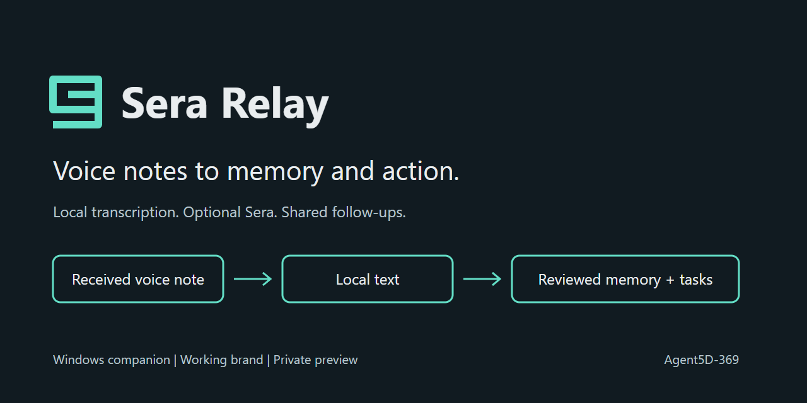
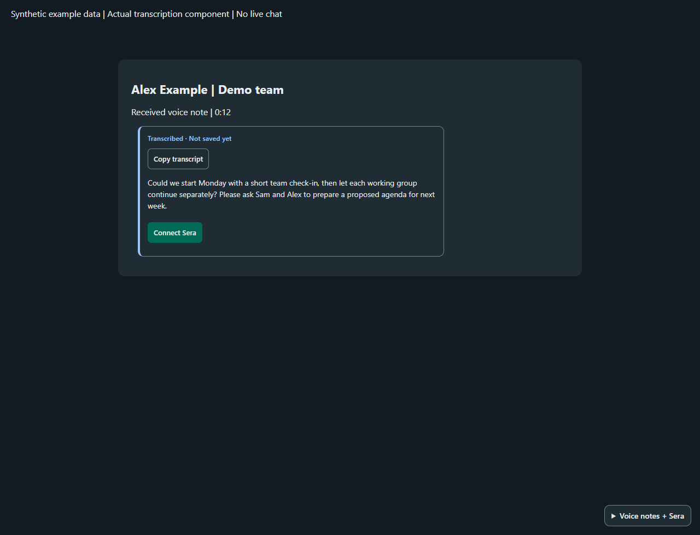
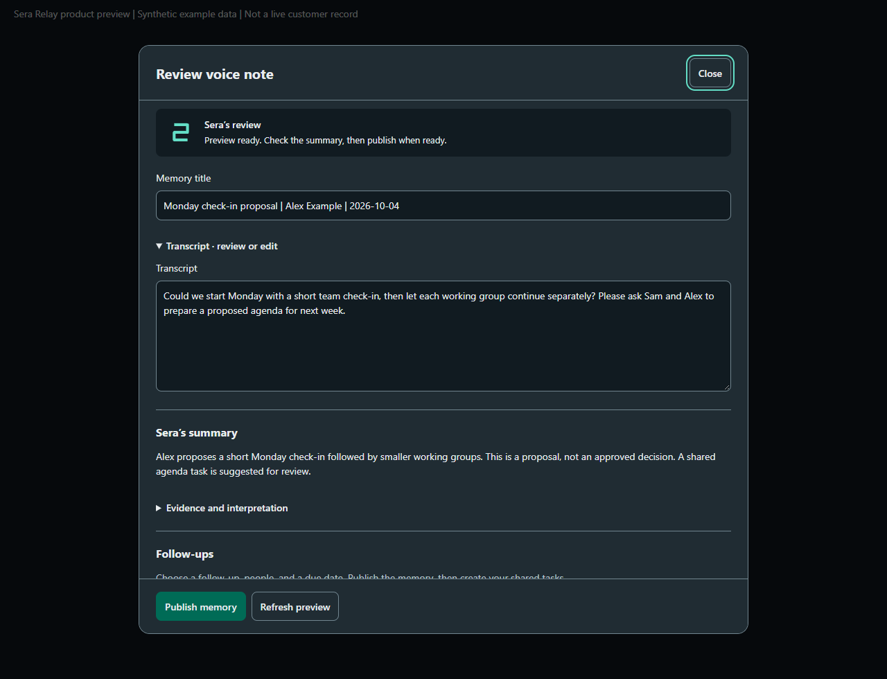
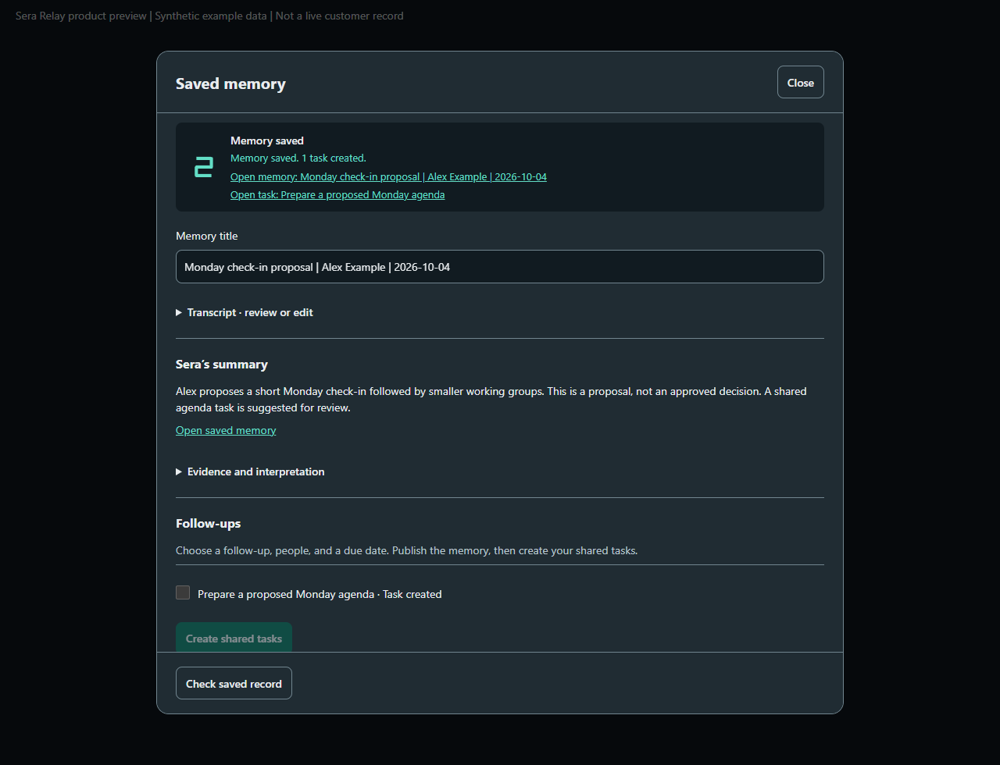

# Sera Relay

Sera Relay transcribes WhatsApp voice notes on your Windows PC and can send notes you select to your Sera workspace for review as shared memories and tasks.

**Version 2.1.0-beta.1:** [Download the Windows x64 release](https://github.com/Agent5D-369/sera-relay/releases/tag/v2.1.0-beta.1). This is an unsigned beta. Windows may show a security prompt.

Screenshots use fictional demo data.

## Features

- Transcribe received and sent voice notes locally with the bundled Whisper model, then read and copy transcripts.
- Optionally send a note you choose to your connected Sera workspace. Review the proposed memory and tasks before saving; nothing is sent automatically.
- Open saved record links in the last-focused regular Chrome or Edge window.

Bulk Markdown export is not available. WhatsApp and optional Sera features require an internet connection. Sera features require your own compatible workspace and may involve provider charges.

## Install

Download and extract the complete Windows x64 ZIP, then run `Install.cmd`. Setup installs Sera Relay for your Windows account and adds Start menu and Desktop shortcuts. Node.js and the Whisper speech model are bundled. Install FFmpeg separately and make sure `ffmpeg` is on `PATH`, or set `VOICE_FFMPEG` to its executable path. Chrome or Edge is also required.

For failed Sera reviews, apply the [review and record-link patch](https://github.com/Agent5D-369/sera-relay/releases/download/v2.1.0-beta.1/SeraRelay-review-record-patch.2.zip) after installing this beta: close Sera Relay, extract the patch, and run `Install-Retry-Patch.cmd`. It preserves transcripts and credentials.

## First use

1. Start Sera Relay and link WhatsApp by following the QR instructions.
2. New received and sent voice notes are transcribed as they arrive. Use the app controls for older notes.
3. Read and copy a transcript. To use Sera, connect your compatible workspace in Settings, select a note, and review the proposed memory and tasks before saving.
4. To open a saved Sera record, focus the Chrome or Edge window signed into the intended workspace before clicking its link.

Transcription accuracy varies with language, recording quality, and background noise. Review transcripts before relying on or sharing them. A saved memory does not mean the speaker verified the transcript or approved recommendations.

## Privacy and data

Speech recognition runs locally. Only notes you explicitly choose for Sera review are sent to that workspace. Sera Relay keeps its WhatsApp session, transcripts, inbox, save receipts, and Windows-encrypted Sera credentials in your Windows user profile, outside the release ZIP. Back up or remove this local data yourself; deleting it also removes local history and sign-in state. Sera records and tasks are stored in the workspace you connect.

## Help and status

See [START-HERE.md](START-HERE.md) for setup, [DEPLOYMENT.md](DEPLOYMENT.md) for source builds, [SUPPORT.md](SUPPORT.md) for help and bug reports, and [SECURITY.md](SECURITY.md) for vulnerability reports. Contributions are welcome under the [MIT License](LICENSE).

Sera Relay is an early beta for 64-bit Windows 10 and 11. Expect rough edges and report reproducible issues. See [CHANGELOG.md](CHANGELOG.md) for release changes.

## Independence

Unofficial companion, not affiliated with or endorsed by WhatsApp or Meta. Uses whatsapp-web.js; upstream changes can affect compatibility. This project does not claim to bypass platform rules.
